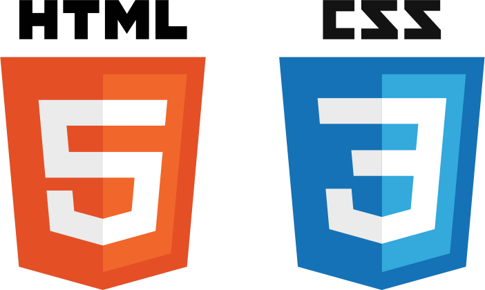

# Curso de HTML5 y CSS3 Avanzado - [IT Master][6]
[6]:http://www.itmaster.com.ar/

Material y diapositivas del curso de HTML5 y CSS3 Avanzado de IT Master.

   

___

### Version
1.0

### Tecnologías
* [CSS3](https://developer.mozilla.org/en-US/docs/Web/CSS)
* [HTML5](https://developer.mozilla.org/en-US/docs/Web/Guide/HTML/HTML5)
* [JavaScript][7]
* [jQuery][8]
[7]:https://developer.mozilla.org/es/docs/Web/JavaScript
[8]:https://jquery.com/

### Autor
Ignacio Anaya
* [Twitter][0]
* [StackOverflow][4]
* [CodePen][3] 
* [Email][1]

[1]:mailto:ignacio.anaya89@gmail.com
[0]:http://twitter.com/ianaya89
[3]:http://codepen.io/ianaya89
[4]:http://stackoverflow.com/users/4195328/ianaya89

### Temario

* Introducción
* Módulo 2: CSS3 Avanzado
* Módulo 2: Offline First
* Módulo 3: AJAX y REST
* Módulo 4: jQuery Pluggins
* Módulo 5: Debugging
* Módulo 6: HTML5 Avanzado

